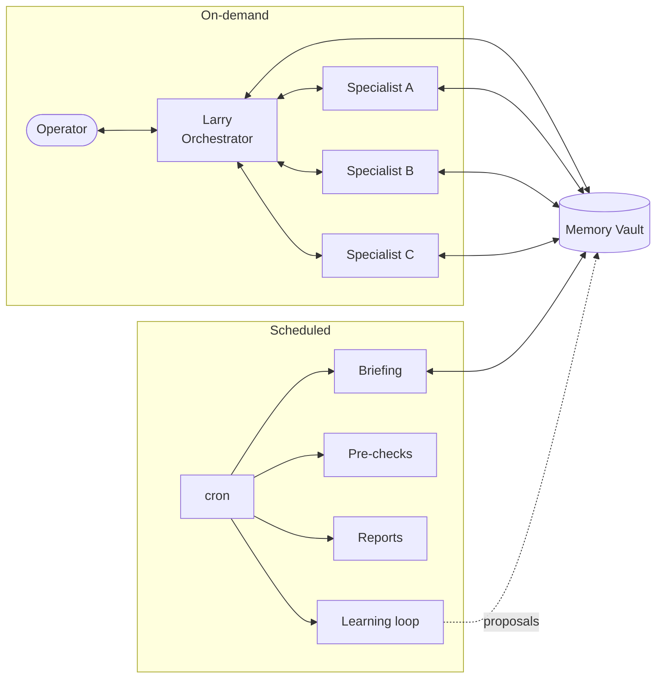

# Architecture

Larry is four cooperating layers: an **orchestrator**, a **specialist fleet**,
a **memory vault**, and a **scheduler**. None is clever on its own; the
leverage is in how they compose.

## 1. The orchestrator

The orchestrator owns the conversation, not the work. Its loop:

1. **Understand** the operator's intent in plain language.
2. **Route** — match intent to a specialist via explicit triggers. If nothing
   matches, do it inline (small tasks only).
3. **Hand off** the minimum context the specialist needs.
4. **Collect** the structured result.
5. **Summarize** tightly for the human.

It deliberately does **not** inline a specialist's job. This keeps each agent's
prompt small, its tool scope tight, and its behavior testable in isolation.

### Composition

Some flows chain two specialists, but only on explicit opt-in:

- **Triage → draft.** A triage agent surfaces threads that need a reply and
  attaches their thread IDs; on request, the drafting agent turns those into
  drafts in one batch.
- **Route → draft.** A routing agent confirms a resource; *after* human
  confirmation, the drafting agent prepares the outreach.
- **Chase → draft.** A follow-up agent finds stalled threads; the drafting
  agent writes the friendly nudge.

The rule across all of them: **the second step never runs unprompted** — the
human says "go" so the draft folder doesn't fill with noise. (One deliberate
exception exists, documented where it lives, where a delivery notification is
drafted automatically — a draft, still never sent.)

## 2. The specialist fleet

Each specialist is defined by four things:

| Attribute | Why it matters |
| --- | --- |
| **Trigger** | A crisp phrase/intent so the orchestrator routes deterministically |
| **Tool scope** | The smallest set of tools needed — most are read-only |
| **Output contract** | What it returns (a digest, a CSV + report, a draft) |
| **Side effects** | Almost always *none* beyond writing a file or a draft |

Specialists fall into three side-effect classes:

- **Read-only** (verify, triage, prep, chase) — observe and report.
- **File-producing** (bulk import/edit, report builders) — emit a file for the
  human to upload; never touch the live system.
- **Draft-producing** (reply drafter) — write a draft for the human to send.

No specialist sends, posts, books, or approves. That invariant is what makes
the system safe to let loose on a real inbox and CRM.

## 3. The memory vault

A folder of Markdown files, version-controlled, also usable as a personal
knowledge base. See [docs/memory-vault.md](docs/memory-vault.md). Key design
choices:

- **Plain files over a vector store** — diff-able, inspectable, portable, and
  good enough at this scale. Retrieval is by index + filename + frontmatter,
  not embeddings.
- **One fact per file** with a `type` tag, so recall can rank by relevance.
- **An index file** loaded every session as the map of what's known.
- **Wired paths are append-only** — scripts depend on certain locations, so
  the maintenance job never renames or moves, only consolidates additively.

## 4. The scheduler

Deterministic cron jobs, most of them **token-free** (plain scripts) so they're
cheap and reliable. They write to the vault and notify the operator. The
ordering matters: pre-checks run before the morning briefing so their findings
can be folded in; the history snapshot runs first so the day's data is durable
before anything reads it.

A subset feeds the **learning loop**
([docs/the-learning-loop.md](docs/the-learning-loop.md)): sensors log what was
proposed, a weekly job compares proposals to reality and writes human-gated
improvement suggestions.

## Why this holds up

- **Small blast radius.** Read-only defaults + file/draft outputs mean a
  misfire produces a wrong *suggestion*, not a wrong *action*.
- **Inspectable state.** Memory is text; history is a local SQLite DB; every
  proposal is logged. You can always answer "why did it do that?"
- **Composable growth.** A new need becomes a new small agent with a trigger,
  not a bigger, riskier prompt.
- **Human-gated learning.** Heuristics change only when a person approves a
  logged, reasoned proposal.
