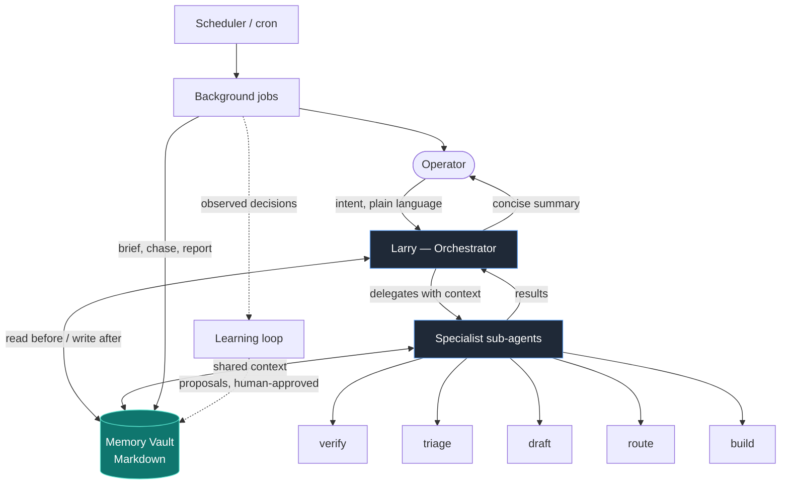

# Larry — a personal multi-agent operations orchestrator

> A conductor agent that runs a fleet of specialist sub-agents, backed by a
> plain-Markdown memory vault and a set of scheduled automations that brief,
> chase, report — and learn from how I actually decide.

Larry is the operations brain I built for myself as an Operations & Customer
Success lead. It doesn't try to be one giant do-everything prompt. It's a
**system**: one orchestrator that understands intent and delegates, a roster of
narrow specialists that each do one job well, a shared memory that survives
across sessions, and background jobs that run whether or not I'm at my desk.

This repository is a **sanitized, generalized showcase** of that system — the
architecture, the patterns, and the design decisions, with all company-,
customer-, and tool-specific details removed. It's meant to be read, not run
as-is. See [Status & scope](#status--scope).

---

## The shape of it

Four moving parts:

1. **The orchestrator** reads intent, picks the right specialist, hands over
   context, collects the result, and summarizes. It does the small stuff
   itself; it never does a specialist's job inline.
2. **The specialist fleet** — narrow, named, single-purpose agents. Each has a
   tight tool scope (most are read-only) and a crisp trigger.
3. **The memory vault** — a folder of plain Markdown files (also browsable as a
   personal knowledge base). Agents read relevant notes *before* a task and
   write learnings *after*.
4. **The scheduler** — deterministic background jobs that brief, watch, report,
   and feed a weekly **learning loop** which proposes improvements I approve by
   hand.

---

## Why a fleet instead of one big agent

| One mega-prompt | Larry's fleet |
| --- | --- |
| Broad, shallow, hard to trust | Narrow specialists with explicit scopes |
| One blast radius for every tool | Most agents are **read-only**; write access is rare and deliberate |
| Forgets between sessions | Shared **Markdown memory** read before / written after each task |
| You're the only safety check | Anything customer-facing is a **draft**, never auto-sent |
| Gets worse as you bolt on tasks | New need → new small agent, composable with the rest |

The win isn't intelligence — it's **operational discipline**: clear triggers,
small blast radii, durable memory, and a human in the loop on anything that
leaves the building.

---

## The fleet

Names are a signature, not a gimmick — a named specialist is easy to invoke
("ask Mara to draft the reply") and easy to reason about. Roles below are
generalized archetypes.

### On-demand specialists

| Agent | Archetype | What it does | Writes? |
| --- | --- | --- | --- |
| **Larry** | Orchestrator | Understands intent, delegates, summarizes | — |
| **Vera** | Document verifier | Checks a document against its source (counts, prices, addresses) and reports deltas | read-only |
| **Conny** | Meeting prep | Reads calendar + related mail, returns a compact per-meeting brief | read-only |
| **Yeti** | Inbox triage | Sweeps email + chat → scannable digest: needs-action / FYI / open to-dos | read-only |
| **Toni** | Ticket triage | Triages CRM/support tickets across pipelines, maintains a shared board | read-only to CRM |
| **Mara** | Reply drafter | Drafts replies **in my writing style** (learned from sent mail); marks missing facts as placeholders instead of guessing | draft only |
| **Nora** | Follow-up chaser | Finds stalled threads (quotes unanswered, approvals pending) and hands them to the drafter | read-only |
| **Felix** | Delivery watcher | Detects when a deliverable is reported "done" and flags the customer notification that's now due | read-only |
| **Piet** | Resource routing | Matches open jobs to field resources by proximity / value / experience / preference; proposes, never books | proposes |
| **Bea** | Bulk importer | Turns a list/table/email into a validated bulk-**import** CSV (new records) + a check report | file only |
| **Edi** | Bulk editor | Builds a bulk-**edit** CSV (changed columns only) for existing records | file only |
| **Greta** | Report builder | Builds the recurring tables for a key account from their planning files | file only |

### Scheduled automations (cron, no human trigger)

| Job | When | What it does |
| --- | --- | --- |
| **Bruno** | daily, early | The morning operational briefing — reconciles the day's data export with CRM/chat/mail and posts the full ops briefing |
| **Falk** | daily, before Bruno | External-constraint pre-check — flags records that fall inside a restricted zone (geospatial/regulatory API); folds into Bruno |
| **Piet** | daily | Same routing engine as the on-demand agent, run proactively to feed Bruno |
| **Hugo** | daily | Token-free snapshot of the data export into a local SQLite DB → makes "since when did X change?" answerable, and lets records survive a rolling-window export |
| **Walter** | weekly | Weekly KPI report (week-over-week deltas) + an HTML visualization |
| **Rita** | weekly | The **learning loop** (see below) |
| **Klara** | monthly | Memory-vault maintenance — dedupe, stale facts, dead links, index gaps (cosmetic fixes directly; content changes only as proposals) |

---

## The memory vault

The vault is just a folder of Markdown files — no database, no embeddings
required, diff-able in git, and openable in any notes app as a personal
knowledge base.

- **Read before, write after.** Agents pull relevant notes before a task and
  write durable learnings after (`customers/…`, `projects/…`, an inbox board).
- **Facts, not chat logs.** One fact per file, with light frontmatter
  (`type: user | feedback | project | reference`) so relevance is easy to
  judge at recall time.
- **Links over folders.** Notes cross-link `[[like-this]]`; an index file is
  loaded each session so the system knows what it knows.
- **Hard boundaries.** No secrets in the vault. Some paths are wired into
  scripts — additive edits only, never rename/move.

This is the part most agent demos skip. Persistent, inspectable memory is what
turns a clever prompt into something that gets *more* useful over weeks.

---

## The learning loop

Most "agentic" systems never close the loop between *what they suggested* and
*what the human actually did*. Larry does, once a week:

1. **Sensors** log every proposal — drafts written, routing suggestions made,
   briefing items snoozed.
2. **Rita** (weekly) compares proposals against reality: drafted reply vs. the
   mail actually sent (style drift), suggested resource vs. the one actually
   chosen (routing heuristic), repeatedly-snoozed items (filter candidates).
3. Rita writes **proposals** to a review file. She never edits a heuristic
   herself.
4. **I approve** with a 👍; the orchestrator then applies the change to the
   target file. Reject → archived with a one-liner.

The result is a system whose heuristics improve from real decisions, with a
human gate on every change.

---

## Design principles

These are the non-negotiables every agent inherits:

- **Anything customer-facing is a draft.** Never auto-send, auto-post, or
  auto-approve. The human decides.
- **Only confirmed facts.** Missing information is reported as missing, never
  filled with a plausible guess.
- **Narrow scopes, small blast radius.** Read-only by default; write access is
  the exception and is explicit.
- **Ask instead of guess** when intent is ambiguous.
- **Conductor, not hero.** The orchestrator delegates and summarizes; it
  doesn't try to be every specialist at once.

More detail in [ETHOS.md](ETHOS.md) and [ARCHITECTURE.md](ARCHITECTURE.md).

---

## Read next

- **[ARCHITECTURE.md](ARCHITECTURE.md)** — how delegation, memory, and the
  scheduler fit together.
- **[ETHOS.md](ETHOS.md)** — the principles, expanded.
- **[AGENTS.md](AGENTS.md)** — the full fleet catalog with triggers and scopes.
- **[docs/memory-vault.md](docs/memory-vault.md)** — the memory model.
- **[docs/scheduled-tasks.md](docs/scheduled-tasks.md)** — the background jobs.
- **[docs/the-learning-loop.md](docs/the-learning-loop.md)** — closing the loop.

---

## Status & scope

This is a **showcase**, not a product. The real system runs against private
calendars, mailboxes, CRMs, and operational data; everything here is
generalized into archetypes and stripped of company-, customer-, and
tool-specific detail. There's no install path because the value is the
**architecture and the patterns**, not a turnkey binary.

Built with [Claude Code](https://claude.com/claude-code) as the agent runtime.

Shared for reference, not licensed for reuse.
