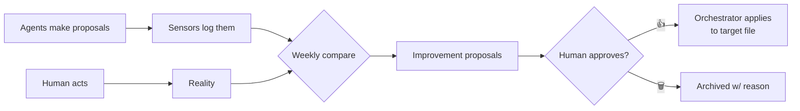

# The learning loop

The part most agent systems skip: closing the gap between what the system
*suggested* and what the human *actually did* — and turning that gap into
better heuristics, with a person gating every change.

## The problem it solves

An agent that drafts replies, suggests assignments, or filters a briefing is
making predictions. Without feedback, those predictions never get better — the
system is exactly as good on day 300 as on day 1. Worse, drift goes unnoticed:
the drafter slowly diverges from how you actually write, and nobody catches it.

## How it closes

1. **Sensors.** Each agent logs its proposals — drafts written, assignments
   suggested, briefing items snoozed. These logs are the raw material.

2. **Weekly comparison.** A scheduled job lines up proposals against reality:
   - **Style:** the draft reply vs. the mail actually sent → did the style
     drift?
   - **Routing:** the suggested resource vs. the one actually chosen → is the
     heuristic miscalibrated?
   - **Filtering:** items snoozed week after week → candidates to filter out of
     the briefing by default.

3. **Proposals, not edits.** The job writes its findings to a review file as
   concrete, worded proposals. It **never** edits a heuristic file itself.

4. **Human gate.** The operator approves with a 👍; the orchestrator then
   applies the change to the actual target file (a style guide, a routing
   heuristic, a filter list). Reject → archived with a one-line reason.

## Why the human gate is non-negotiable

Autonomous self-modification is where agent systems go quietly wrong: a bad
inference becomes a permanent rule, compounding silently. Keeping a person on
the approval step means improvement is continuous but never unattended — and
every behavior change has a name and a date attached to it.

## What this buys you

- Heuristics that track reality instead of the assumptions baked in on day 1.
- Early detection of drift (style, routing) before it becomes a habit.
- A briefing that gets quieter over time as noise is filtered out.
- A full audit trail: every change traces back to an observed gap and an
  explicit approval.
